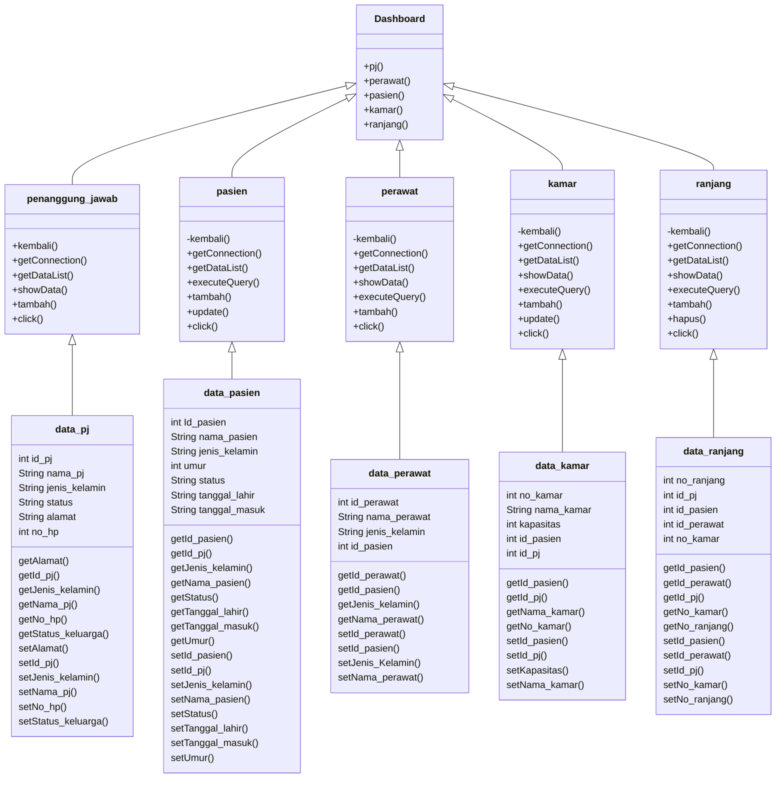
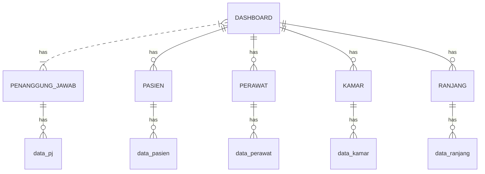

# Panti_Jompo
> Anggota Kelompok :
> 1. 1907051004 - Gista Anggraini MZ
> 2. 1907051010 - Winda Ayu Triyani 
> 3. 1907051029 - Faris Ubad Alfharuq
> 
> Sistem ini dapat di gunakan untuk menginputkan data pasien, penanggung jawab,perawat,kamar,dan ranjang
> 
> Pada class diagram ini menggunkan relasi assosiasi karena setiap classnya memiliki satu hubungan dengan class tertentu atau lainnya. Dimana dashboard sebagai parents atau induknya yang memiliki class diantaranya :
> 1.  Penanggung_jawab
> 2.  Pasien
> 3.  Perawat
> 4.  Kamar
> 5.  Ranjang
> 
> Yang masing-masing class nya pula memiliki connector yaitu berupa class baru dengan nama:
> 1.  Data_pj
> 2.  Data_pasien
> 3.  Data_perawat
> 4.  Data_kamar
> 5.  Data_ranjang
> 
> Pada ERD ini menggunakan has diantara relasinya. Maksudnya has disini semua kelas saling memiliki, adapun penjabarannya :
>Dashboard sebagai class parents atau induk memiliki 5 buah anak class (classnya) diantaranya, class penanggung_jawab, class pasien, class perawat, class kamar, dan class ranjang. 
>
>Dimana masing masing class tersebut juga memiliki sebuah class connector yang diantaranya :
>Data_pj, data_pasien, data_perawat, data_kamar, dan data_ranjang. Maka dari itu menggunakan has karena dari setiap class tersebut saling memiliki.

Libraries and Tools of this project:
- mysql-connector-java-8.0.19.jar
- scene builder
- mysql server 
- netbean editor
- VS Code installed plugin
  - Markdown All in one
  - Markdown preview
  - Live Server
  
## Desain
To view the diagrams below install mermaid-diagram plugin at https://github.com/Redisrupt/mermaid-diagrams 

### classDiagram

### ER Diagram

